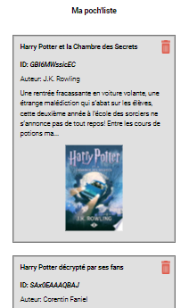
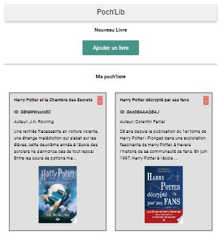

# Poch'Lib

  

Poch'Lib is a web application designed to allow users to search for books online and add them to a personalized reading list before picking them up at the "La plume enchantée" bookstore. The application is developed as a Single Page Application (SPA) and is fully responsive, supporting at least three different formats:

- Mobile
- Tablet
- Desktop

## Table of Contents
- [Project Overview](#project-overview)
- [Technologies Used](#technologies-used)
- [Installation](#installation)
- [Running the Application](#running-the-application)
- [How to Use](#how-to-use)
- [Screenshots](#screenshots)

## Project Overview

Poch'Lib was developed for "La plume enchantée," a local bookstore, to enhance the customer experience by allowing them to browse and reserve books online. The main features of the application include:

- Searching for books using the Google Books API.
- Adding books to a personalized reading list (poch'liste).
- Removing books from the reading list.

## Technologies Used

- [IDE (VSCODE, Intellij, etc.)](#)
  - [Visual Studio Code](https://code.visualstudio.com/)
  - [IntelliJ IDEA](https://www.jetbrains.com/idea/)
- [HTML5]
- [JavaScript]
- [Node JS](https://nodejs.org/)
- [Sass]
- [Fetch API for HTTP requests](https://developer.mozilla.org/en-US/docs/Web/API/Fetch_API)
- [Google Books API](https://developers.google.com/books/docs/v1/using?hl=fr)

## Installation

To install and set up the project locally, follow these steps:

1. **Clone the repository:**
    git bash
    git clone https://github.com/sfbyzulia/BENADIBAH-Zulfiyya-pochlib-frontend

2. **Navigate to the project directory**

This project does not require additional dependencies. Ensure you have a modern web browser installed.

## Running the Application
To run the application, open the index.html file in your preferred web browser. You can do this by double-clicking the file or by using a live server extension in your IDE.

## How to Use

1. **Launch the application:** Open the index.html file in your web browser.
2. **Search for books:**
- Click on the "Ajouter un livre" button to reveal the search form.
- Enter the title and/or author of the book you want to search for.
- Click the "Rechercher" button to display the search results.

3. **View search results:**

- The search results will appear below the form, showing relevant books based on your search criteria.
- Each book entry includes the title, author, description, and book cover image.

4. **Manage your reading list (poch'liste):**
- Click the bookmark icon on a book entry to add it to your reading list.
- To remove a book from your reading list, click the trash icon on the book entry in the poch'liste section.

5. **Session persistence:**
- Books added to your reading list will be saved for the duration of your browsing session.

## Screenshots

  
  
  
  
  

